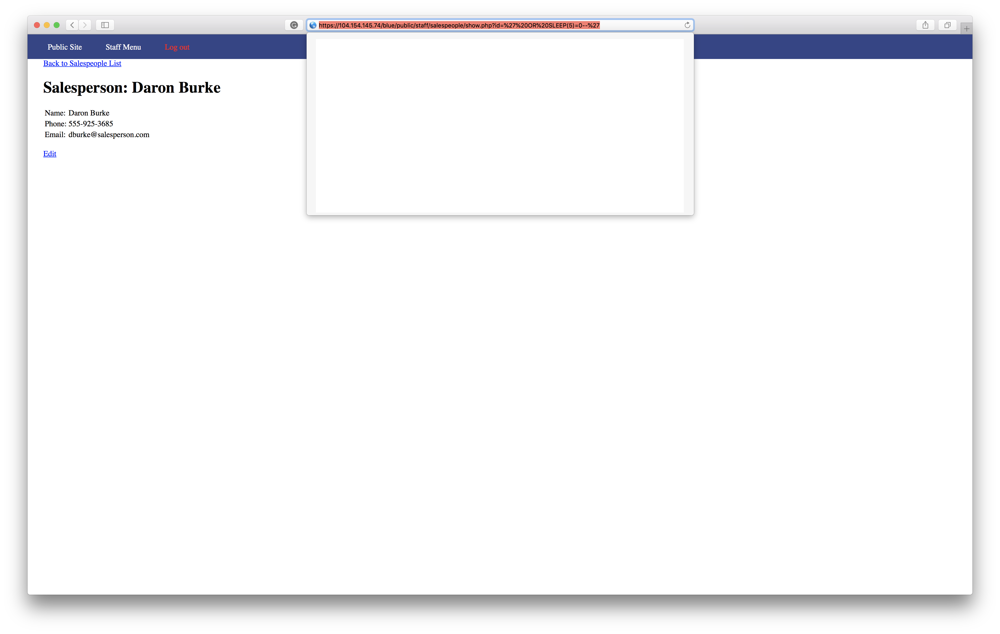

# Project 8 - Pentesting Live Targets

Time spent: **4** hours spent in total

> Objective: Identify vulnerabilities in three different versions of the Globitek website: blue, green, and red.

The six possible exploits are:
* Username Enumeration
* Insecure Direct Object Reference (IDOR)
* SQL Injection (SQLi)
* Cross-Site Scripting (XSS)
* Cross-Site Request Forgery (CSRF)
* Session Hijacking/Fixation

Each version of the site has been given two of the six vulnerabilities. (In other words, all six of the exploits should be assignable to one of the sites.)

## Blue

**Vulnerability #1:** SQL Injection (SQLi)

  ```
  %27%20OR%20SLEEP(5)=0--%27
  ```
* Website will halt for five seconds because of our code

**Vulnerability #2:** Session Hijacking/Fixation

* Get victim's session ID from the hacktool

* Open up the website on your side and direct yourself to /index.php (Make sure intercept is on)


* Change Session ID value to one that we just stole

* We are in


## Green

**Vulnerability #1:** Username Enumeration

*I want to note that enumeration is not only way to tell if username exists. You can basically guess or use a username of the person from another website, as people try to get the same username on all the websites.*

* Try jmonroeX as your login, where X is a number from 0 to infinity. [I used pperson, because I had this username in my db]
* If username exists, the website will display it as **bold** text.


**Vulnerability #2:** Cross-Site Scripting (XSS)

- Send feedback with this code: `<script>alert('Daulet found the XSS!');</script>`
- As soon as admin opens Feedback page, the XSS will be executed.


